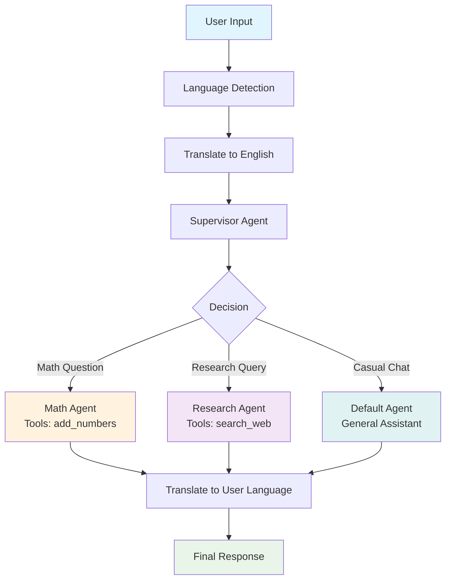

 Multi-Agent System

A multilingual assistant system featuring AI agents with different expertise areas and automatic language detection.

## Features

- **Multi-Language Support**: Automatic language detection and translation
- **Expert Agents**:
  - Math Agent: For mathematical calculations and problem-solving
  - Research Agent: For information search and research tasks  
  - General Assistant: For casual conversations and general questions
- **Smart Routing**: Automatic task distribution via supervisor agent
- **Memory**: Conversation history storage and context retention

## System Architecture



## Requirements

```bash
langchain-openai
langchain-core
langgraph
gradio
```

## Installation

1. Clone the repository:
   ```bash
   git clone https://github.com/Ataerman/Multi_agent_example.git
   cd Multi_agent_example
   ```

2. Install required packages:
   ```bash
   pip install langchain-openai langchain-core langgraph gradio
   ```

3. Create a `config.py` file and add your OpenAI API key:
   ```python
   openai_api_key = "YOUR_API_KEY_HERE"
   ```

## Usage

```bash
python test1.py
```

After starting the program, you can ask questions in any language. The system will automatically detect the language and route your query to the appropriate expert agent.

## How It Works

1. **Language Detection**: The system first detects the language of your input
2. **Translation**: If needed, translates your question to English for processing
3. **Supervisor Decision**: A supervisor agent analyzes your question and decides which expert should handle it
4. **Expert Processing**: The appropriate agent processes your request using specialized tools
5. **Response Translation**: The response is translated back to your original language
6. **Memory**: The conversation is stored for context in future interactions

## Project Structure

- `test1.py`: Main application file containing the multi-agent system
- `config.py`: API key configuration (not included in repository for security)
- `.gitignore`: Files to be ignored by Git
- `README.md`: Project documentation

## Agent Details

### Math Agent
- **Purpose**: Handles mathematical calculations and problem-solving
- **Tools**: `add_numbers` function for basic arithmetic
- **Capabilities**: Step-by-step mathematical problem solving

### Research Agent  
- **Purpose**: Handles information search and research queries
- **Tools**: `search_web` function for web search simulation
- **Capabilities**: Information gathering and comprehensive research responses

### Default Agent
- **Purpose**: Handles casual conversations and general questions
- **Tools**: General conversation capabilities
- **Capabilities**: Friendly chat, greetings, and general assistance

## Technology Stack

- **LangChain**: For LLM integration and tool management
- **LangGraph**: For multi-agent workflow orchestration
- **OpenAI GPT-3.5-turbo**: As the underlying language model
- **Python**: Core programming language

## Contributing

Feel free to fork this repository and submit pull requests for improvements.

## License

This project is licensed under the MIT License. 
